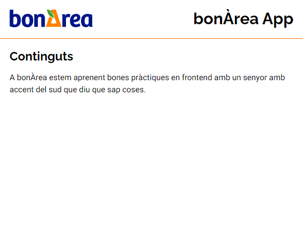

# Ejercicios React

## Ejercicio 1

A partir de este boilerplate inicial, crea una app que coincida con esta maqueta:

Color corporativo: ff6b00;

Tamaño fuente: 16px;

Aire dentro de los contenedores: 20px;

Tipografía del texto principal: Heebo Variable

Tipografía de los encabezados: Raleway Variable
